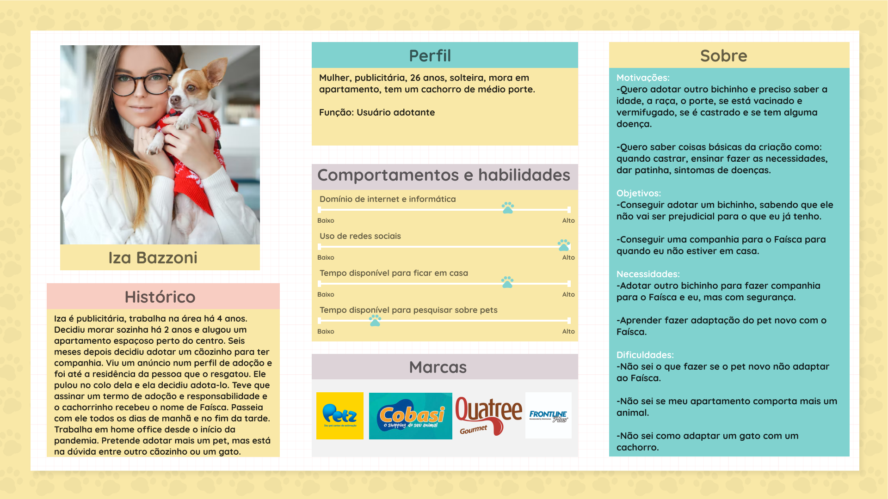
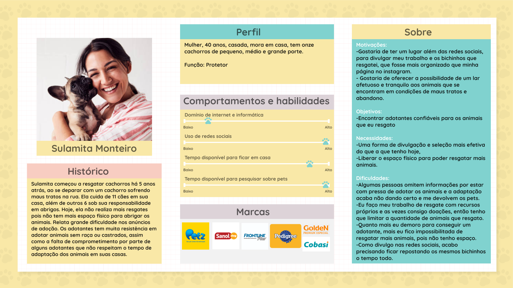
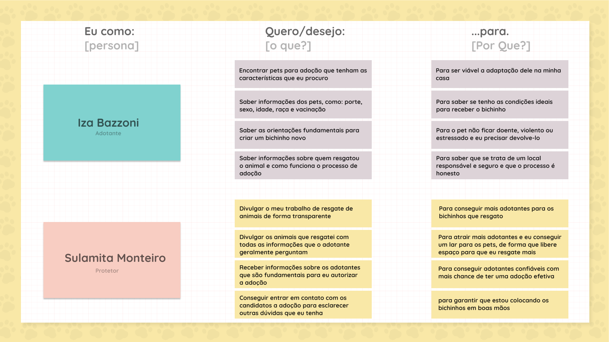
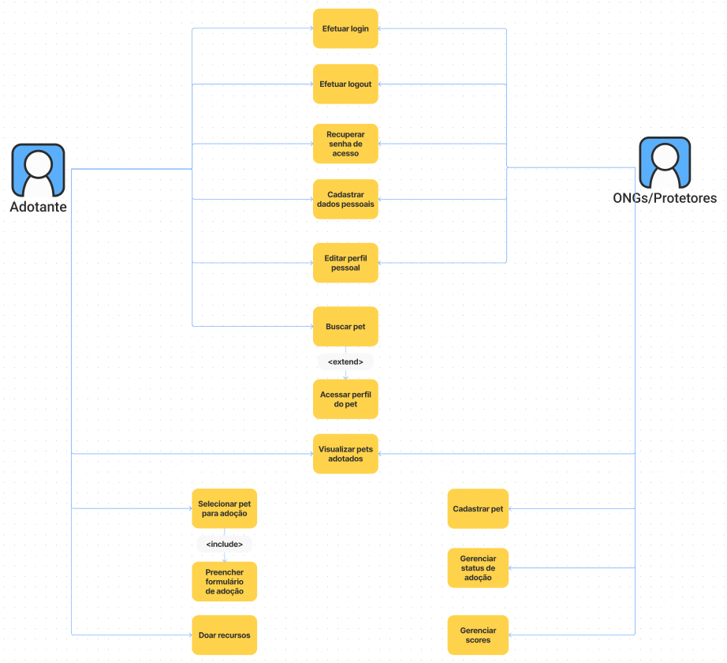

# Especificações do Projeto

Pré-requisitos: [Documentação de Contexto](https://github.com/ICEI-PUC-Minas-PMV-ADS/pmv-ads-2022-1-e2-proj-int-t3-adotar-pets.git)

A definição exata do problema e os pontos mais relevantes a serem tratados neste projeto foi consolidada com a participação dos usuários em um trabalho de imersão feito pelos membros da equipe a partir da observação dos usuários em seu local natural e por meio de entrevistas. Os detalhes levantados nesse processo foram consolidados na forma de personas e histórias de usuários.

## Personas

As personas levantadas durante o processo de entendimento do problema são apresentadas na Figuras que se seguem.

## Histórias de Usuários

Com base na análise das personas forma identificadas as seguintes histórias de usuários:

## Requisitos

As tabelas que se seguem apresentam os requisitos funcionais e não funcionais que detalham o escopo do projeto.

### Requisitos Funcionais

| ID     | Descrição do Requisito                                                                                                                                                                                                                | Prioridade |
|--------|---------------------------------------------------------------------------------------------------------------------------------------------------------------------------------------------------------------------------------------|------------|
| RF-001 | O site deverá possuir uma landing page, com campoS de busca, links para autenticação, cartões informativos e outras ferramentas básicas para a navegação na plataforma.                                                               | ALTA       | 
| RF-002 | O site deverá fornecer um formulário de cadastro para Pessoa Física (adotantes) Pessoa Jurídica (ONGs / protetores).                                                                                                                  | ALTA       |
| RF-003 | O site deverá fornecer um formulário de login único para todas as entidades de usuário.                                                                                                                                               | ALTA       |
| RF-004 | O site deverá fornecer um link de logout para todos os usuários autenticados.                                                                                                                                                         | ALTA       |
| RF-005 | O site deverá permitir, por parte das ONGs e protetores, o cadastro de animais para adoção com fotos, descrição, condições especiais e pontuação mínima para recebimento direto de pedidos de adoção.                                 | ALTA       |
| RF-006 | O site deverá fornecer aos adotantes uma página de busca de animais para adoção, com filtros por tipo de animal, porte, raça e gênero.                                                                                                | ALTA       |
| RF-007 | O site deverá possuir uma página dedicada para o perfil do pet cadastrado, com botões para o fluxo de adoção ou de doação para a entidade responsável.                                                                                | ALTA       |
| RF-008 | O site deverá fornecer um questionário de adoção dinâmico, com sistema interno de pontuação (score), que será respondido por adotantes e direcionados, por e-mail, ao responsável pelo animal se a pontuação mínima for satisfatória. | ALTA       |
| RF-009 | O site deverá fornecer às ONGs e protetores a possibilidade de gerenciar os dados de um animal cadastrado, bem como seu status de disponibilidade para adoção.                                                                        | MÉDIA      |
| RF-010 | O site deverá fornecer às ONGs e protetores uma listagem de todos os pedidos de adoção para um animal específico, mesmo aqueles que ficaram abaixo do score mínimo para notificação direta.                                           | MÉDIA      |
| RF-011 | O site deverá fornecer um formulário de edição de perfil para todas as entidades de usuário.                                                                                                                                          | MÉDIA                                                                                                                                                                              |      |
| RF-012 | O site deverá possuir uma página padrão com informações de endereço para doação de produtos/mantimentos.                                                                          | BAIXA      |
| RF-013 | O site deverá possuir uma página, referenciada no rodapé, de informações sobre a plataforma e seus serviços prestados (Sobre Nós).                                                                                                    | BAIXA      |
| RF-014 | O site deverá possuir uma página, referenciada no rodapé, de contato com o setor administrativo da plataforma.                                                                                                                        | BAIXA      |
| RF-015 | O site deverá possuir uma página, referenciada no rodapé, de Termos de Uso da plataforma.                                                                                                                                             | BAIXA      |
| RF-016 | O site deverá possuir uma página, referenciada no rodapé, de Política de Privacidade.                                                                                                                                                 | BAIXA      |

### Requisitos não Funcionais

| ID     | Descrição do Requisito                                                                                | Prioridade |
|--------|-------------------------------------------------------------------------------------------------------|------------|
| RNF-01 | O site deverá atender os requisitos de compatibilidade com o navegador Google Chrome.                 | ALTA       | 
| RNF-02 | O site deverá utilizar banco de dados relacional (MySQL).                                             | ALTA       | 
| RNF-03 | Escolher um serviço de hospedagem de boa qualidade para otimizar e aumentar a performance do website. | ALTA       |

## Restrições

O projeto está restrito pelos itens apresentados na tabela a seguir.

| ID    | Restrição                                                                                                   |
|-------|-------------------------------------------------------------------------------------------------------------|
| RE-01 | O projeto deverá ser entregue no final do semestre letivo, não podendo extrapolar a data de 26/06/2022.     |
| RE-02 | A plataforma deverá se restringir às linguagens (e seus respectivos frameworks) HTML, CSS, JavaScript e C#. |
| RE-03 | A equipe não pode subcontratar o desenvolvimento do trabalho.                                               |

## Diagrama de Casos de Uso

