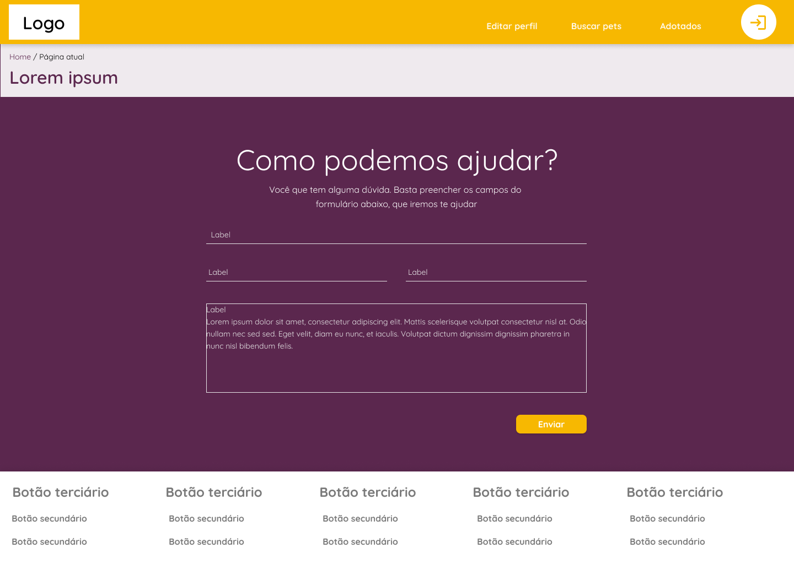

# Projeto de Interface

Pré-requisitos: <a href="2-Especificação do Projeto.md"> Documentação de Especificação</a>

Visão geral da interação do usuário pelas telas do sistema e protótipo interativo das telas com as funcionalidades que fazem parte do sistema (wireframes).

 Apresente as principais interfaces da plataforma. Discuta como ela foi elaborada de forma a atender os requisitos funcionais, não funcionais e histórias de usuário abordados nas <a href="2-Especificação do Projeto.md"> Documentação de Especificação</a>.

## Diagrama de Fluxo
O diagrama que define o fluxo do nosso sistema é representado a seguir:

## Wireframes

Foram desenvolvidos wireframes interativos e de alta fidelidade na ferramenta Figma, para ajudar na definição da estrutura da solução web e para facilitar o entendimento da relação entre as possíveis páginas existentes no sistema. Para visualizar o prótipo interativo basta acessar o link a seguir:

> - [Protótipo Interativo](https://www.figma.com/proto/hBpZSSxuKOJAF3Xi9j7UkZ/Wireframes?page-id=2%3A2&node-id=84%3A224&viewport=241%2C48%2C0.07&scaling=min-zoom&starting-point-node-id=84%3A224)

A seguir a descrição de todas as páginas do sistema.

### RF-001 - Landing Page

A Landing Page é o ponto inicial do projeto. Ao entrar no endereço do website, o usuário será direcionado para essa página. Nela contém um banner inicial sobreposto com o botão que dá acesso a página de busca de animais para adoção. Abaixo, terá um texto explicativo sobre a importância da adoção. Em seguida, algumas dicas sobre cuidados com animais e um botão que encaminha o usuário para a página de dicas.

### RF-002 - Tela de Cadastro de Pessoa Física

A tela de cadastro de pessoa física é uma tela criada para o usuário que deseja utilizar a plataforma para encontrar animais para adoção. Nela é oferecido um formulário em que o usuário preenche suas informações pessoais e cria as credenciais de acesso ao sistema. Além disso, há um botão para caso o usuário seja uma ONG, ele seja direcionado ao cadastro de pessoas jurídicas. 

### RF-002- Tela de Cadastro de Pessoa Jurídica

A tela de cadastro de pessoa jurídica é uma tela destinada aos usuários que desejam utilizar a plataforma para divulgar os animais para adoção e suas próprias informações para o recebimento de doações. Nela é oferecido um formulário em que o protetor preenche suas informações e cria credenciais de acesso ao sistema. Além disso, há um botão para caso o usuário seja um adotante, ele possa ser direcionado ao cadastro de pessoas físicas. 

### RF-003-Tela de Login 

Quando o usuário acessa o website e não está logado na plataforma, na barra de 
navegação, no topo da página, haverá um botão de acesso rápido ao login do sistema. Optou-se pelo uso do modal para que não aconteça uma interrupção na navegação. O modal contém inputs em que o usuário deverá digitar suas credenciais de acesso. Há um botão para cadastro, no caso de o usuário ainda não ser cadastrado e um botão para recuperação da senha, se o usuário a tiver esquecido. 

### RF-005- Tela de Cadastro de Animais

A tela de cadastro de animais é uma página disponível apenas para o usuário protetor (pessoa jurídica) e só pode ser visualizada quando o usuário está logado na plataforma. Nela é possível que o protetor cadastre seu animal com suas informações e faça o upload das fotos do pet. Ao final há um botão para
salvar e o animal é cadastrado no sistema. 

### RF-006- Tela de Busca de Animais

Quando o usuário optar por buscar um animal ele será direcionado para a página de busca. Na lateral esquerda haverá filtros e a direita os cards dos animais com suas respectivas informações. Esses são reativos às mudanças feitas pelos filtros, podendo aparecer ou desaparecer de acordo com os filtros selecionados. Ao clicar em um dos cards o usuário é redirecionado à página de perfil do pet escolhido. 

### RF-007- Tela de Perfil do Pet

A tela de perfil do Pet é a página em que o usuário encontrará as principais informações sobre o animal e as fotos do mesmo. Além disso, estará disponível dois botões, sendo o primeiro o botão que permite que o usuário tenha acesso às informações do protetor com quem aquele animal se encontra, inclusive para fazer doações. O segundo botão é para o caso de o usuário desejar se candidatar para adoção daquele animal. Ao clicar nesse botão o adotante é encaminhado para o formulário de doação do pet. 

### RF-008- Formulário de Adoção

Na tela de formulário de adoção, estará disponível, para o adotante, perguntas que devem ser respondidas e enviadas pelo sistema ao protetor responsável pelo animal. Ao final do questionário há um botão para o envio das respostas, ao clicar aparecerá um modal confirmando o envio. 

### RF-009-010 Gerenciamento de Pets

A tela de gerenciamento de pets só estará disponível para o usuário protetor (pessoa jurídica), quando estiver logado no sistema. Nessa página o protetor pode monitorar quantos e quais animais estão disponíveis para adoção no sistema e alterar suas informações e status e verificar se há formulários preenchidos por potenciais adotantes.

### RF-011- Tela de Perfil do Protetor

A tela de perfil do protetor só estará disponível se o usuário estiver logado no sistema. Nela o usuário pode alterar as informações que forneceu durante o seu cadastro, acrescentar novas informações, fazer upload da imagem de perfil trocar a senha caso tenha necessidade. 

### RF-011- Tela de Perfil do Adotante

A tela de perfil do adotante só estará disponível se o usuário estiver logado no sistema. Nela o usuário poderá alterar as informações que forneceu durante o seu cadastro, acrescentar novas informações, fazer upload da foto perfil e trocar a senha se necessário. 

### RF-012- Tela de informações do Protetor

A tela de informações do protetor contém as principais informações sobre a entidade que está com animal, assim como as informações ou links necessários para que o usuário adotante possa entrar em contato ou fazer doações. 

### RF-013- Sobre Nós

A tela "sobre nós" possibilitará que o usuário saiba as principais informações sobre o projeto que motivou a criação da plataforma e quem a idealizou. 

### RF-014- Contatos

Na tela de contatos o usuário poderá enviar uma mensagem para o suporte do sistema. Ele deve inserir um e-mail válido por onde receberá a confirmação do envio e a resposta para a mensagem enviada. 

### RF-015-016- Termos de Uso e Políticas da Empresa
A tela de Termos de uso e Política da Empresa será acessada pelo botão no rodapé presente em todas as páginas do sistema e nela conterá os termos de contrato da plataforma bem como os termos de uso e política da empresa.

