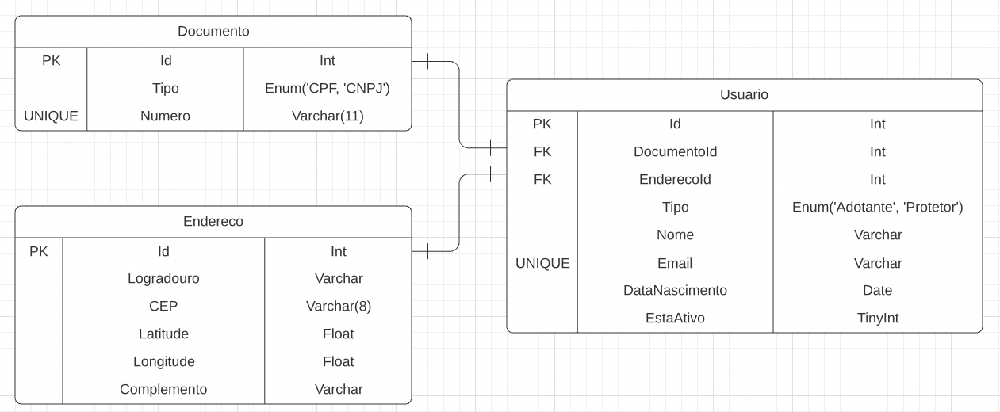
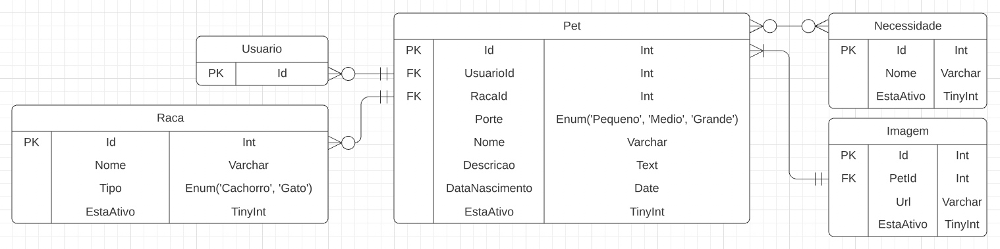
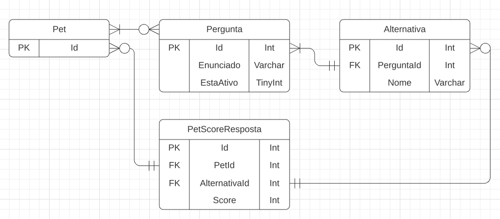
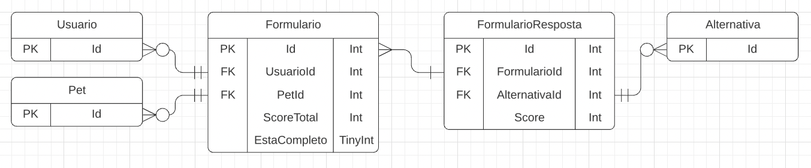

# Arquitetura da Solução

Pré-requisitos: <a href="3-Projeto de Interface.md"> Projeto de Interface</a>

Definição de como o software é estruturado em termos dos componentes que fazem parte da solução e do ambiente de hospedagem da aplicação.

## Diagrama de Classes

## Modelo ER

## Tecnologias Utilizadas

Descreva aqui qual(is) tecnologias você vai usar para resolver o seu problema, ou seja, implementar a sua solução. Liste todas as tecnologias envolvidas, linguagens a serem utilizadas, serviços web, frameworks, bibliotecas, IDEs de desenvolvimento, e ferramentas.

Linguagens de progamação:
- C#
- Javascript

Linguagem de marcação:
- HTML

Frameworks:
- Bootstrap
- .NET Core
- Entity Framework Core

IDEs de desenvolvimento:
- Visual Studio Code

Banco de Dados:
- MySQL

## Hospedagem

A equipe, a princípio optou pela plataforma do GitHub Pages para hospedagem do Front-end e para Back-end optamos pelo Azure. 
