# Registro de Testes de Software

Foram realizados os testes de acordo com as tabelas mostradas no item 8, testes de funcionalidades e de controle de acesso, podendo ser resumidos na tabela abaixo:

| Código do Teste | Descrição | Score |
|---------------------|-----------------------|-------------|
| CT-01 | Fluxo de cadastro de animais | 3 |
| CT-02 | Fluxo de adoção do usuário adotante | 3 |
| CT-03 | Cadastro de novos usuários na plataforma | 3 |
| CT-04 | Login de usuários | 3 |

O score dos testes seguem a tabela mostrada no item anterior, assim foram realizado os testes da seguinte forma.

## Testes de Funcionalidade:

### CT - 01:

O acesso a plataforma é realizado pela página de login, e será feita com o usuário, de Protetor de teste:

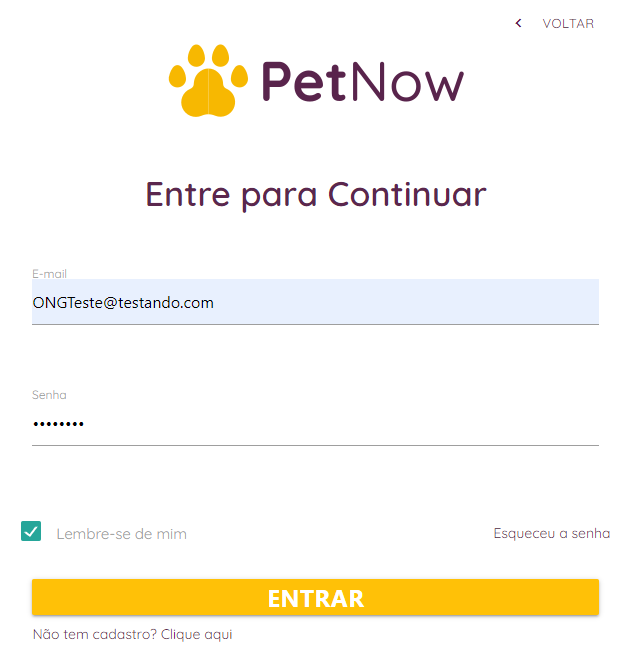

Na aba de navegação, após o login de usuário protetor, ficará disponível os botões de cadastrar novo pet e gerenciar pets, essas serão responsáveis pelo fluxo de pets da plataforma:

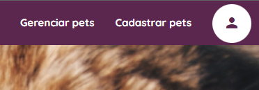

Ao acessar a funcionalidade de cadastro o usuário entra na tela de cadastro, preenchendo os campos:

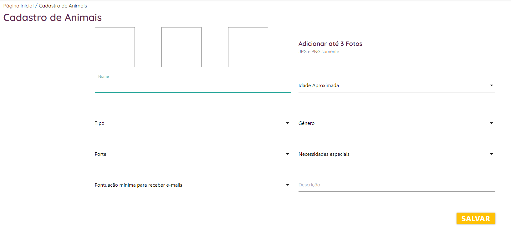
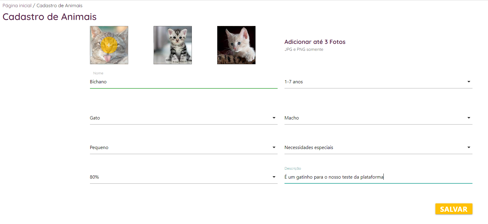
Há uma aba onde a ONG poderá citar os casos especiais dos animais, caso tenham, conforme abaixo
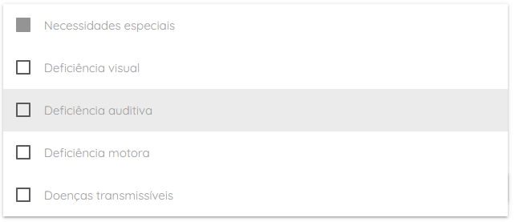

Ao salvar, o usuário é redirecionado para a tela de gerenciamento dos Pets cadastrados em sua ONG:

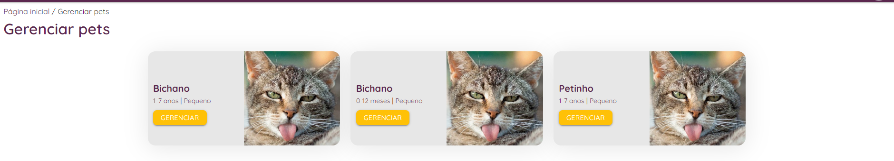

O perfil do pet é acessado por um usuário nas suas buscas, assim ele tem acesso ao seu perfil:

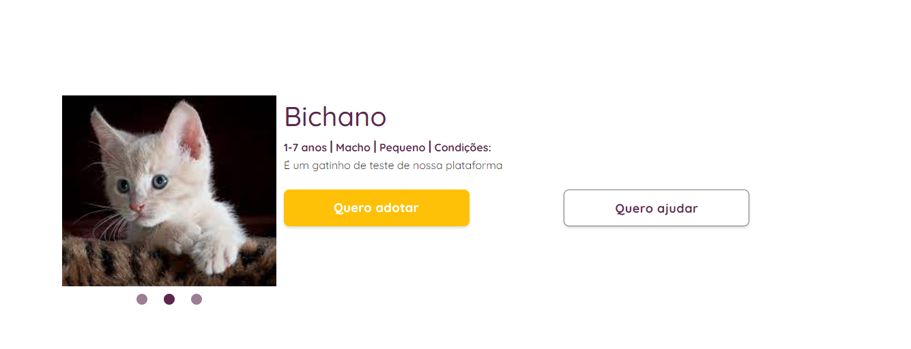

Após podemos realizar alterações no pet cadastrado e verificarmos essas alterações no seu perfil

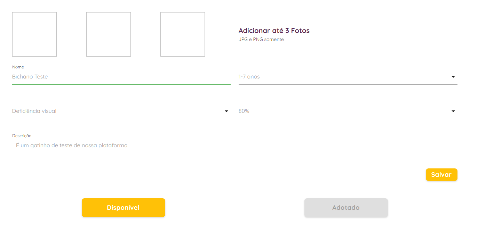
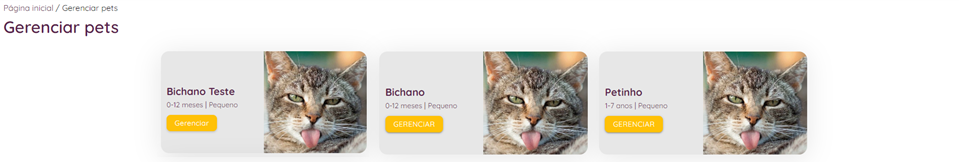

Dessa forma, podemos verificar que o cadastro e a edição dos pets estão cumprindo todas as etapas do teste sem problemas, assim adquirindo o status de teste 3. 
### CT - 02

Com o acesso de usuário adotante, pode-se realizar uma busca por pets nos botões na barra de navegação ou na Landing page:

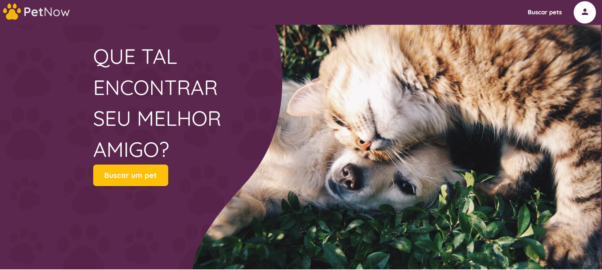

O usuário pode acessar todos os pets cadastrados na plataforma ou realizar buscas por: Tipo (Gato ou Cachorro), Porte (Pequeno, Médio ou Grande), Idade (Filhote, Adulto ou Idoso) e Gênero (Macho ou Femia).

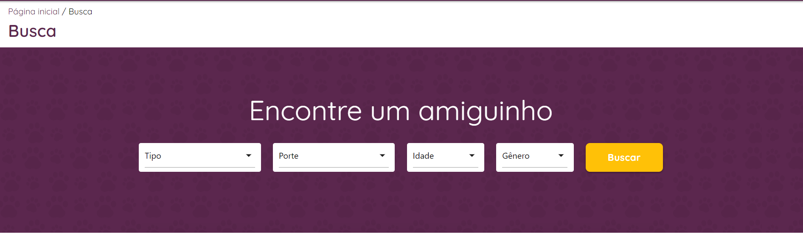

Acessando o perfil do pet cadastrado no caso de teste anterior, o usuário pode realizar o procedimento de adoção, no botão de "Quero adotar".

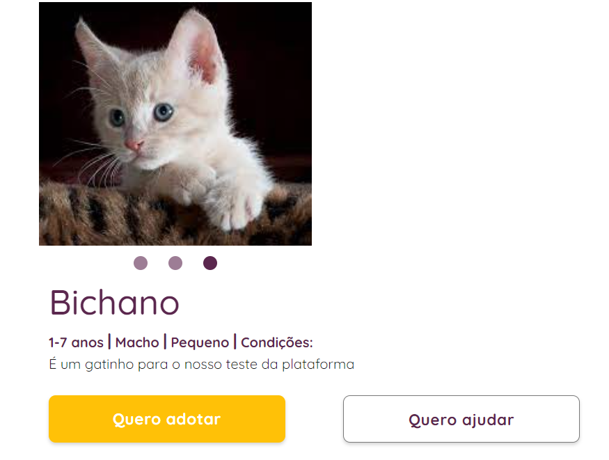

O usuário deve responder o questionário para dar prosseguimento ao processo de adoção do pet.

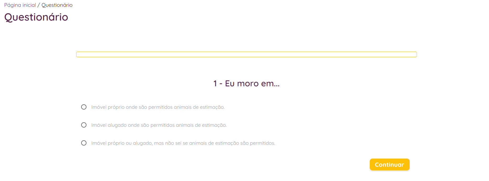

Ao final do questionário o usuário recebe uma nota que o processo foi encaminhado a ONG.

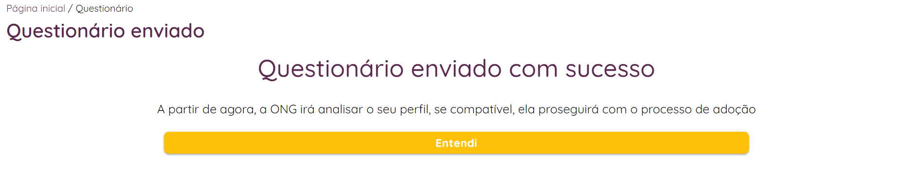

Após o preenchimento do formulário de adoção, aparecerá na aba de gerenciamento da ONG o histórico do formulário preenchido pelo usuário e sua pontuação.

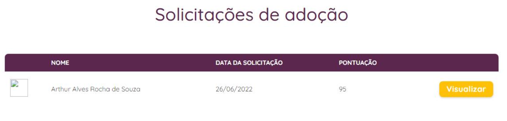

Conforme visto o teste cumpre todos os requisitos de aceitação, sem apresentar problemas, assim tendo um status de 3.

## Testes de controle de acesso:

### CT - 03:

O acesso a pagina de cadastro de novos usuários pode ser realizada acessando a página de login, pelo botão superior da landing page da plataforma, conforme a imagem:

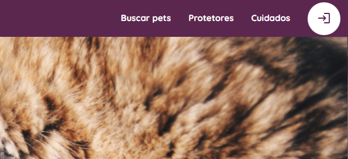

Ao acessar a pagina de login o usuário estará na sessão de login, podendo se cadastrar no botão “Clique aqui” abaixo do botão de entrar, conforme a imagem:

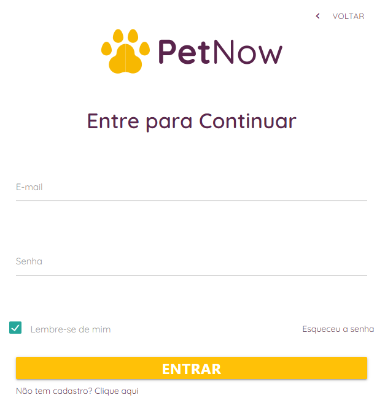

Na pagina de cadastro os usuários se diferenciam entre adotante e protetor pelo tipo de documento que é inserido, nesse caso, o usuário adotante será uma pessoa física utilizando um CPF e no caso de uma ONG será utilizado um CNPJ. Para o teste foram realizadas 7 situações simuladas para verificar os controles de cadastro de novos usuários, bem como, observar as validações utilizadas.

### 3 -	Casos de teste:
#### a.	Algum campo faltante;
##### Validação: Todos os campos devem está preenchidos.
#### b.	CNPJ ou CPF errado;
##### Validação: Validação lógica dos documentos CPF e CNPJ.
#### c.	Data de nascimento de usuário menor que 18 anos;
##### Validação: Idade atual do usuário.
#### d.	CEP errado
##### Validação: CEP válido.
#### e.	Email errado
##### Validação: Email válido.
#### f.	Senhas com menos de 8 caracteres e não combinantes;
##### Validação: Tamanho da senha e se combinam.
#### g.	Usuários testes: Adotante e ONG;
##### Validação:
| Tipo do Usuário | Adotante | Protetor |
|-----------------|----------|-----|
| Nome            |Usuário Teste|OngTeste|
|CPF/CNPJ         |530.634.160-88|41.426.959/0001-70|
|CEP              |41218-155 |92440-592|
|Data de Nascimento|01/01/1990|01/01/1990|
|Email            |usuarioTeste@testando.com|ONGTeste@testando.com|
|Senha            |teste123   |teste123|

### a.	Algum campo faltante:

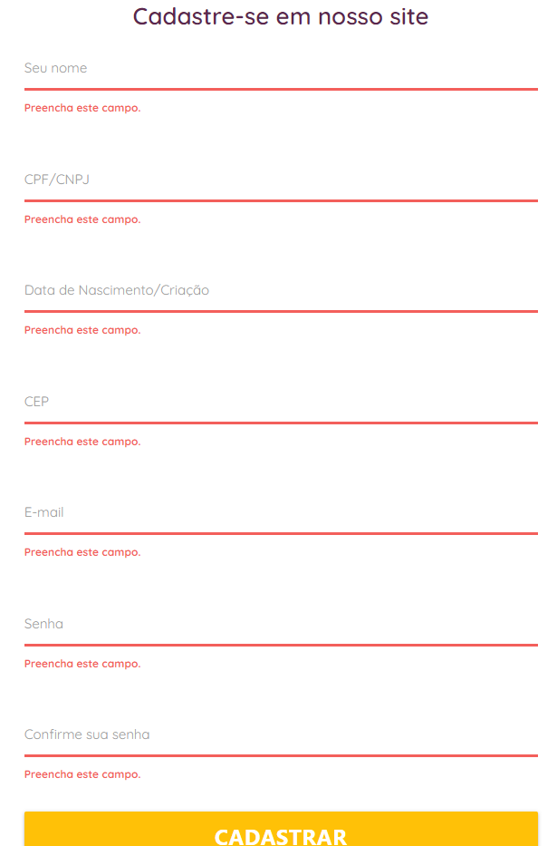

### b.	CNPJ ou CPF errado:

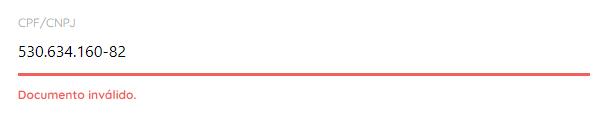

### c. Data de nascimento de usuário menor que 18 anos;

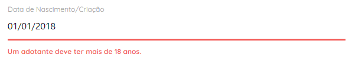

### d.	CEP errado

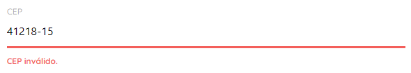

### e.	Email errado

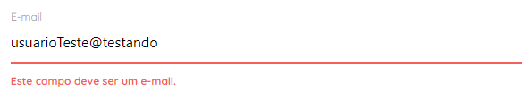

### f.	Senhas com menos de 8 caracteres e não combinantes

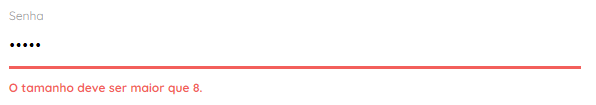

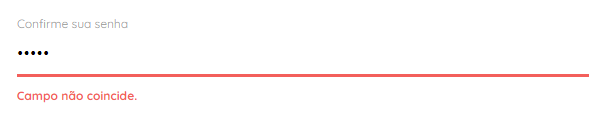

### g.	Usuários testes: Adotante e Protetor;

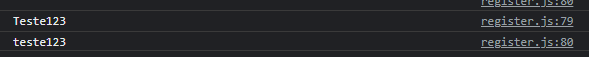

Nessas imagens podemos observar que os usuários foram cadastrados e podem ter acesso a área restrita de usuário (ONG ou Adotante). Podemos obeservar que as validações elaboradas funcionaram conforme o esperado, assim podemos atribuir o score 3 para esse teste.

### CT - 04:

Utilizando os usuários cadastrados do CT-04, pode-se realizar o login desses usuários na plataforma, neste teste será testado os seguintes casos:

### 4 - Casos de Testes:
#### a. Campos errados.
##### Validação: Não permitir que o usuário tenha acesso a plataforma sem as credenciais cadastradas (email e senha)
#### b. Login adotante.
##### Validação: usuarioTeste@testando.com, teste123
#### c. Login protetor.
##### Validação: ONGTeste@testando.com, teste123

Para o primeiro caso, acessamos a página de login, e foram realizados os testes:

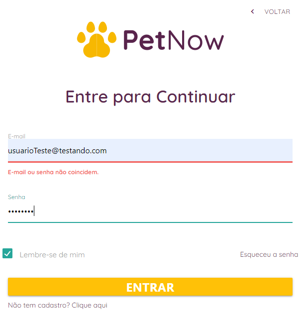

Para o teste de acesso do usuário temos:

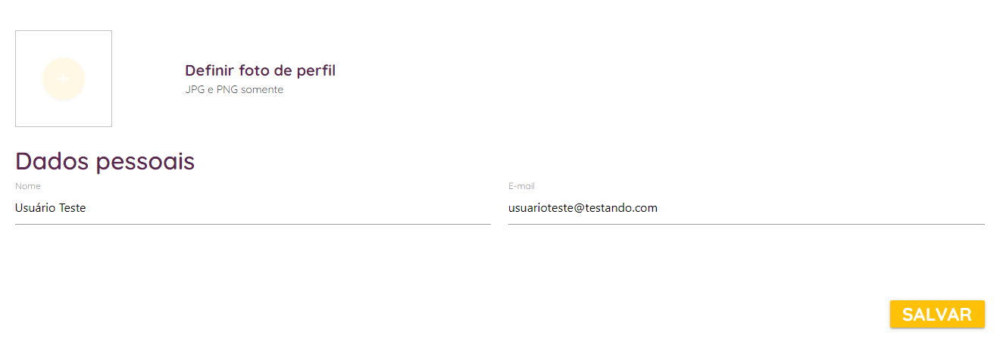

Foi possível o acesso do usuário a uma área do usuário adotante, podendo editar os campos de imagem, nome e email. Ao ser alterado um desses campos, é enviado um alerta da plataforma confirmando a alteração:

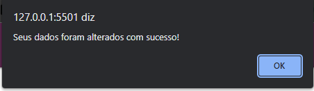

O Logout é feito por meio do botão na tela superior clicando em sair:

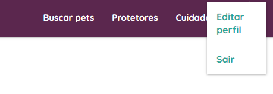

Ao clicar em sair o usuário é reenviado para a landing page, o teste foi realizado com a ong teste cadastrada, obtendo os mesmos resultados, assim podemos classificar esse teste com um score 3.
